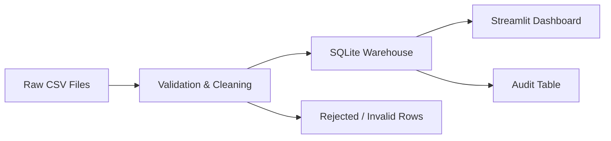

# Architecture

## Overview

The project follows a compact batch analytics architecture that separates ingestion, storage, and presentation.

## Components

### 1. Data Source

Raw CSV files are stored in `batch_ingestion_pipeline/data/raw/`. These represent the landing zone for the batch process.

### 2. Ingestion Layer

The pipeline reads each CSV file, normalizes column names, and validates required fields before loading.

### 3. Transformation Layer

Valid rows are cleaned and enriched with fields such as:

- `total_amount`
- `order_year`
- `order_month`

### 4. Storage Layer

Processed data is written into SQLite tables:

- `orders_fact`
- `batch_runs`

This keeps the project lightweight while still behaving like a real warehouse-backed analytics system.

### 5. Presentation Layer

The Streamlit dashboard reads the warehouse and displays:

- KPI cards
- Trend charts
- Audit history
- Filtered tables
- Data quality metrics

The dashboard is designed as a quick management view for reviewing pipeline health and business signals.

## Data Flow

1. Place source CSV files in the raw folder.
2. Run the batch ingestion script.
3. The pipeline validates and loads clean rows.
4. The audit table stores per-file run details.
5. The dashboard queries the database and renders insights.
6. The top-level root launcher keeps the UI easy to run from the GitHub repository root.

## Why This Architecture Works

- It is easy to understand and present.
- It separates ingestion, storage, and presentation.
- It can run locally without cloud dependencies.
- It is realistic enough for a data engineering portfolio.
- It includes both operational detail and a user-facing analytics layer.
