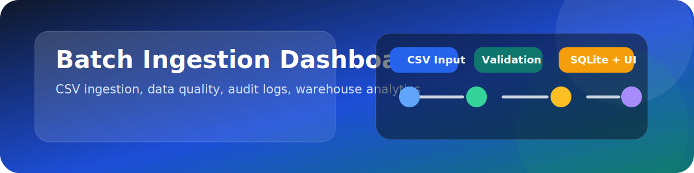
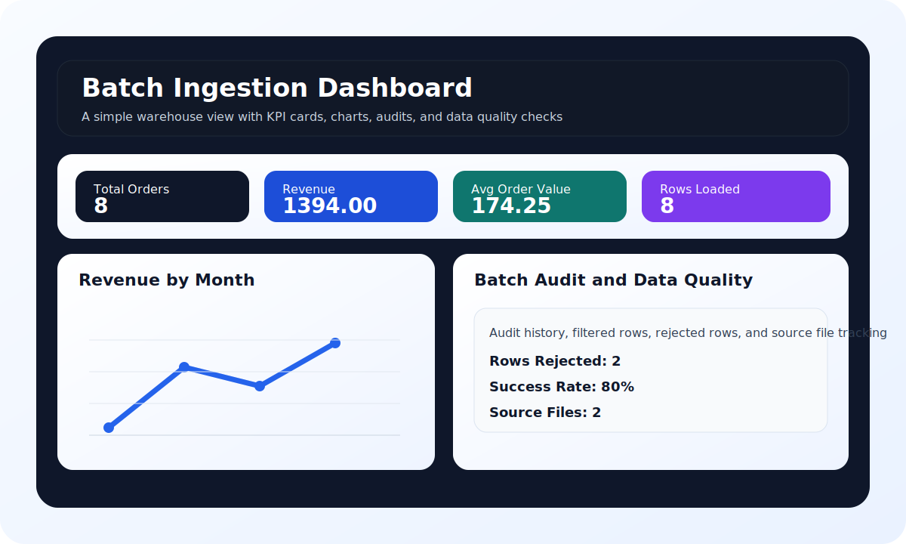

# SAP Project - Batch Ingestion Dashboard

**Name:** Aryan Bhargava  
**Roll No:** 23051491

A polished data engineering project that ingests CSV files, validates and transforms records, loads curated data into SQLite, and presents the results in a Streamlit dashboard.

[](https://www.python.org/)
[](https://streamlit.io/)
[](https://www.sqlite.org/)
[](#)



[Architecture](ARCHITECTURE.md) | [Project Report](PROJECT_REPORT.html) | [Markdown Report](PROJECT_REPORT.md) | [Demo Guide](batch_ingestion_pipeline/DEMO.md) | [Project README](batch_ingestion_pipeline/README.md)

## At a Glance

- Batch CSV ingestion from a landing folder
- Data validation and cleaning
- Curated warehouse loading with SQLite
- Batch audit logging
- Business summary reporting
- Interactive Streamlit frontend
- Windows-friendly demo launcher

## Repository Layout

```text
Sap_Project/
├── app.py                      # Root launcher for the dashboard
├── ARCHITECTURE.md            # System design and flow
└── batch_ingestion_pipeline/  # Full project implementation
    ├── app.py                 # Main Streamlit dashboard
    ├── DEMO.md                # Demo walkthrough
    ├── README.md              # Project-specific instructions
    ├── run_demo.ps1           # One-command demo runner
    ├── pyproject.toml         # Dependencies and packaging
    ├── data/                  # Sample inputs, logs, warehouse
    ├── src/                   # Ingestion package code
    └── tests/                 # Unit and integration tests
```

## What It Does

1. Raw CSV files are placed in `batch_ingestion_pipeline/data/raw/`.
2. The pipeline validates required columns and cleans invalid values.
3. Valid rows are loaded into `orders_fact` in SQLite.
4. Each file load is recorded in `batch_runs`.
5. The dashboard reads the warehouse and visualizes the results.

## Features

### Data Pipeline

- Normalizes column names
- Rejects invalid rows with missing or malformed values
- Calculates `total_amount`, `order_year`, and `order_month`
- Writes a batch audit trail for each processed CSV file

### Dashboard

- KPI cards for total orders, revenue, average order value, and loaded rows
- Filters for category, country, month, and batch name
- Revenue charts by category and month
- Batch audit history
- Loaded orders table
- Data quality snapshot
- Country mix and load success indicators

### Demo Experience

- One-command batch run with `run_demo.ps1`
- Root-level dashboard launcher through `app.py`
- Ready-to-present sample data and output

## Quick Start

### 1. Install Dependencies

```powershell
cd batch_ingestion_pipeline
python -m venv .venv
.venv\Scripts\activate
pip install -e .
```

### 2. Run the Batch Demo

```powershell
.\run_demo.ps1
```

### 3. Open the Dashboard

From the repository root:

```powershell
streamlit run app.py
```

## Expected Output

After running the demo, the dashboard shows data similar to:

- Files processed: 2
- Total rows loaded: 8
- Total revenue: 1394.00
- Top category: Electronics

## Visual Preview



The screenshot-style preview above shows the main UI layout: KPI cards, revenue trend, audit tracking, and quality summary.

## Data Model

- `orders_fact` stores the cleaned order-level facts
- `batch_runs` stores the audit trail for each ingestion run

## Why This Project Stands Out

This project combines ETL logic, data quality handling, persistence, and analytics into one portfolio-ready solution. It is simple enough to run locally, but complete enough to demonstrate real data engineering thinking.

## Project Report

The full submission-style report is available in:

- [PROJECT_REPORT.html](PROJECT_REPORT.html) for print-friendly PDF export
- [PROJECT_REPORT.md](PROJECT_REPORT.md) for quick editing and review
